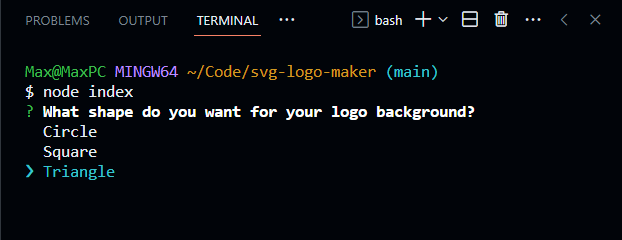

# SVG Logo Maker

---
This is a command line application that generates simple SVG logos based on the answers to user prompts.

## Installation
Clone the repo to your computer, open your terminal in the root directory of the application, and run `npm i` to download the necessary node packages.
## Usage
Here's a short [video](https://drive.google.com/file/d/1Ey1r6LNREHE176vW8rYFjFlybTM-1Ail/view) demonstrating how the application is used.

---
Powered by [node.js](https://nodejs.org/en) and [Inquirer](https://www.npmjs.com/package/inquirer)